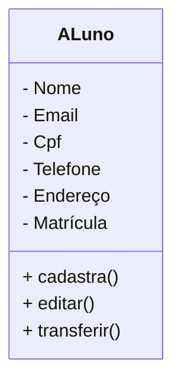

# Projeto Universidade

modedas lagem em orientação a objetivos  entidadess alunos, cursos e turmas

## Caso de Uso
 ```mermaid
 flowchart LR
    Usuario([secretaria])
    UC1((cadastrar alunos))
    UC2((editar alunos))
    UC3((transferir alunos))

    Usuario --> UC1
    Usuario --> UC2
    Usuario --> UC3
 ```
## Diagrama de Classes


### Depedencias
- **VSCode**: IDE (interface de Desenvolvimento)

- **Mermaid**: linguagem para confecção de diagrama gi